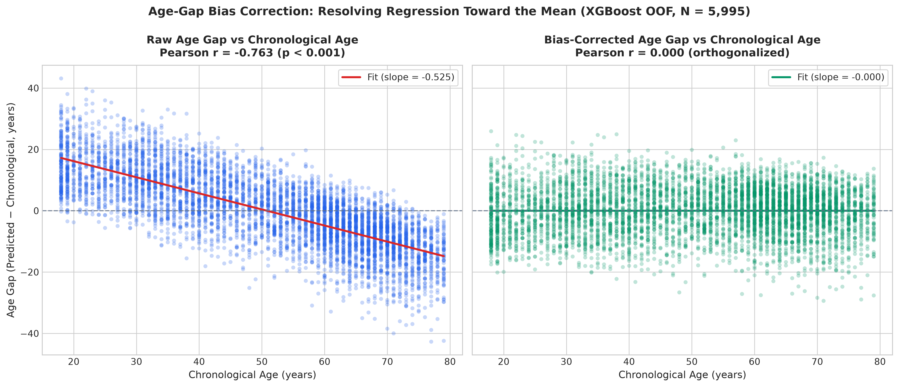

# Biomarker-Based Age Prediction & SHAP Interpretation

Predicting chronological age from routine clinical biomarkers, estimating each person's age gap (predicted age − chronological age), and examining which biomarkers the model relies on, using Tree-SHAP.

**Data:** 5,995 adults aged 18–79 from the NHANES August 2021–August 2023 cycle (U.S. National Health and Nutrition Examination Survey), built from 8 linked survey tables.

**Scope:** The model is trained to predict chronological age. The age gap is a common starting point for biological-age research, but it is only meaningful as a marker of biological aging once it is corrected for its known dependence on age and shown to relate to health outcomes. See [Limitations](#limitations).

---

## Results

Four regression models were evaluated using 5-fold cross-validation on the full cohort (N = 5,995, ages 18–79), stratified by age bracket (18–34, 35–49, 50–64, 65–79). Preprocessing (median imputation and standard scaling) was fitted strictly inside each training fold to prevent data leakage.

| Model | Test MAE (years) | Test RMSE (years) | Test R² |
|:---|:---:|:---:|:---:|
| Linear regression (OLS) | 11.22 ± 0.07 | 13.63 ± 0.09 | 0.395 ± 0.010 |
| Ridge regression (α = 10) | 11.23 ± 0.07 | 13.62 ± 0.10 | 0.395 ± 0.011 |
| Random forest | 9.98 ± 0.15 | 12.45 ± 0.22 | 0.495 ± 0.020 |
| **XGBoost** | **9.71 ± 0.15** | **12.08 ± 0.18** | **0.525 ± 0.016** |

The tree-based models outperform the linear baselines, consistent with non-linear relationships and interactions between biomarkers. No single biomarker correlates strongly with age on its own (all |r| < 0.35), so age prediction relies on combining many weak signals.

---

## Age-Gap Bias Correction

Because regression models regress toward the cohort mean, the raw age gap (predicted age − chronological age) exhibits an artificial negative correlation with chronological age (r = −0.763, p < 0.001): younger adults are systematically over-predicted and older adults are systematically under-predicted.

Using out-of-fold predictions from 5-fold cross-validation on the XGBoost model, the raw gap is regressed on chronological age ($\hat{\Delta} = 26.65 - 0.525 \times \text{Age}$), and the residual is used as the bias-corrected age gap. By construction, the corrected gap is uncorrelated with chronological age, so it can be compared across ages.



---

## Which biomarkers does the model rely on? (SHAP)

Global feature importance from `shap.TreeExplainer` on the XGBoost model trained on the original 80/20 split, computed on its held-out test set (N = 1,199). Mean |SHAP| is the average absolute contribution of a feature to the predicted age, in years.

SHAP describes how the model uses each feature to predict chronological age. It shows which biomarkers are most informative about age in this cohort; it does not show that a biomarker causes aging.

| Rank | Feature | Column | Mean \|SHAP\| (years) | Context |
|:---:|:---|:---|:---:|:---|
| 1 | Glycated hemoglobin (HbA1c) | `log_LBXGH` | 5.37 | HbA1c rises with age in this cohort (r = +0.31 after log transform). |
| 2 | Waist-to-height ratio | `WHtR` | 3.05 | Central adiposity tends to increase with age. |
| 3 | Mean corpuscular volume | `LBXMCVSI` | 2.79 | Red blood cell volume increases with age (r = +0.26). |
| 4 | Former smoker | `smoking_Former Smoker` | 1.60 | Former smokers are ~10 years older on average than never-smokers here, so this feature partly acts as an age proxy. |
| 5 | Creatinine | `log_LBXSCR` | 1.49 | Rises with age, consistent with declining kidney function; strongly sex-dependent. |
| 6 | Platelet count | `LBXPLTSI` | 1.37 | Declines with age (r = −0.17). |
| 7 | Body weight | `BMXWT` | 1.24 | Related to adiposity measures above. |
| 8 | BMI | `BMXBMI` | 1.22 | Highly correlated with weight and waist (r ≈ 0.9), so importance is shared among them. |
| 9 | Income-to-poverty ratio | `INDFMPIR` | 1.11 | Socio-economic factor; association may reflect confounding. |
| 10 | Fasting glucose | `log_LBXSGL` | 1.06 | Correlated with HbA1c (r = +0.78). |

---

## Methodology

- **Cohort construction.** 8 NHANES tables (demographics, body measures, biochemistry, glycohemoglobin, cholesterol, smoking, complete blood count, physical activity) merged with inner joins: 11,933 → 6,337 participants. Laboratory tests are run on a subsample and not everyone completed the physical activity questionnaire, which explains most of the reduction. Details in [notes.md](notes.md).
- **Top-coded age.** NHANES records everyone aged 80+ as exactly 80, which distorts a regression target. These participants were removed: 6,337 → 5,995.
- **Skewed biomarkers.** log(1 + x) applied to heavily skewed variables (e.g. creatinine, fasting glucose, triglycerides, HbA1c); sedentary time additionally capped at the 95th percentile.
- **Collinearity.** Hematocrit dropped (r = 0.97 with hemoglobin); waist-to-height ratio added as an adiposity measure.
- **Planned missingness.** Fasting laboratory values exist only for a subsample; this is tracked with a `was_fasting_sample` indicator rather than treated as random missingness.
- **Leakage prevention.** Cross-validation and train/test splits performed before fitting; imputation and standard scaling fitted strictly on training data within each fold.

---

## Limitations

- **Age-gap correction is linear.** The gap is corrected with a linear regression on age; any non-linear dependence on age is not removed.
- **No outcome validation.** The age gap has not yet been tested against health outcomes, so it should not be read as a validated measure of biological aging.
- **SHAP is descriptive.** Feature importances describe the model, not biological mechanisms, and some features (e.g. smoking status) are confounded with age.
- **Survey design.** NHANES sampling weights are not used, so results describe this sample rather than the U.S. population.
- **Cross-sectional data.** One measurement per person; no individual aging trajectories.

---

## Interactive demo

A Streamlit app lets you enter a biomarker profile and see the predicted age together with a per-person SHAP waterfall explanation. It is a research prototype and is not intended for clinical use.

```bash
streamlit run app.py
```

Then open `http://localhost:8501`.

---

## Repository structure

```
biological-age-predictor/
├── app.py                      # Streamlit demo
├── requirements.txt
├── notes.md                    # Decision log: cohort construction, EDA, feature choices
├── README.md
├── data/
│   ├── raw/                    # NHANES 2021–2023 XPT files
│   └── processed/              # train_data.csv, test_data.csv
├── models/
│   ├── final_model.pkl         # Trained XGBoost model
│   └── scaler.pkl              # StandardScaler fitted on training data
├── notebooks/
│   ├── 02_eda.ipynb            # Exploratory data analysis
│   ├── 04_modeling.ipynb       # Training and evaluation
│   └── 05_shap_analysis.ipynb  # SHAP analysis
├── results/
│   ├── cv_results.csv          # 5-fold cross-validation summary
│   ├── cv_results_per_fold.csv # Per-fold cross-validation metrics
│   ├── age_gaps.csv            # Per-participant raw & corrected age gaps
│   └── figures/
│       └── age_gap_correction.png # Age-gap bias correction plot
└── src/
    ├── data_loader.py          # Loading and merging the 8 NHANES tables
    ├── eda_utils.py            # Plotting and collinearity utilities
    ├── feature_engineering.py  # Transforms, WHtR, activity levels, train/test split
    ├── models.py               # Single-split model training and evaluation
    ├── evaluate_cv.py          # 5-fold stratified cross-validation pipeline
    ├── age_gap.py              # Out-of-fold prediction and age-gap bias correction
    └── explainability.py       # SHAP computation
```

---

## Reproducing the results

```bash
git clone https://github.com/benchohrabdou/biological-age-predictor.git
cd biological-age-predictor

python -m venv venv
source venv/bin/activate  # Windows: .\venv\Scripts\activate

pip install -r requirements.txt

python src/data_loader.py          # load and merge NHANES tables
python src/feature_engineering.py  # build train_data.csv and test_data.csv
python src/models.py               # train and evaluate single-split models
python src/evaluate_cv.py          # run 5-fold stratified cross-validation
python src/age_gap.py              # compute out-of-fold corrected age gaps & plot
python src/explainability.py        # compute SHAP values
```